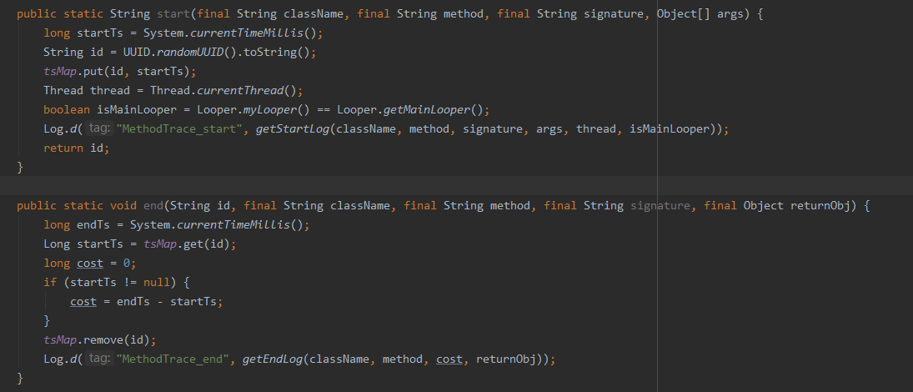
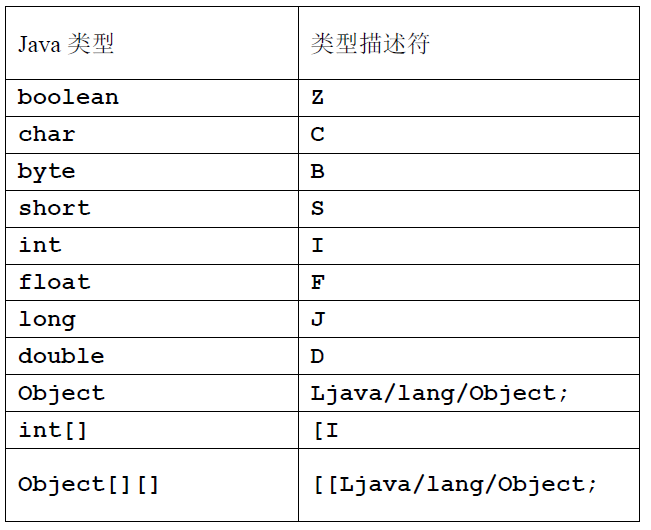

# Uatu

用于项目中方法替换和方法的跟踪(查看参数, 返回值, 方法耗时等).

## 用法

一:
root project `build.gradle`中添加:

```
classpath com.vinctor.plugin:uatu:0.2.0
```
二:
app module `build.gradle`中:

应用:
```
apply plugin: 'uatu'
```
添加配置:
```
UatuConfig {
    enable = true
    traceConfig {
        enable = true
        logAllArgs = true
        traceClass = 'com.vinctor.Trace'
        tracePackage = ['com.vinctor.Uatu.MainActivity','com.vinctor.Uatu.test.Test']
        exclude = ['com.vinctor.Uatu.test.TestExclude']
    }

    replaceConfig {
        enable = true
        configFile="replaceFile.json"
    }
}
```
## 详细说明:

```
UatuConfig->enable :插件配置是否可用(false:traceConfig和replaceConfig都不可用)
```
配置分为两部分: 方法跟踪和方法替换

###  方法跟踪 traceConfig

```
enable     : 是否可用
logAllArgs : 是否输出方法的参数
traceClass : 方法跟踪的输出类(全限定名), 由使用者自行实现
tracePackage : 要跟踪的类或包名(全限定名),  方法跟踪以类为单位, 添加到列表的类中的所有方法都会被跟踪
exclude : tracePackage中要排出的类列表
```


* `traceClass`

方法跟踪的输出类, 该类为使用者自行实现,需要声明两个静态方法`start`和`end`,  被跟踪方法会调用这两个静态方法,如下:

 ```
* 方法参数在start中, 方法返回值在end方法中,使用public修饰
* 可以在两者记录时间,计算差值即为方法耗时,
* 可以获取当前线程, 获取当先线程信息
* 可以判断Looper, 判断是否为主线程
* etc.(自由发挥)


/**
 * 当进入一个方法时会调用
 *
 * @param className 被跟踪的类名
 * @param method    被跟踪的方法名
 * @param signature 被跟踪的方法描述
 * @param args      被跟踪的方法参数
 * @return 用来识别方法唯一标识, randomUUID, 或int累加
 */
 public static String start(final String className, final String method, final String signature, Object[] args){}
 
/**
 * 当退出一个方法前会调用
 *
 * @param id        上面start方法返回的标识, 可根据标识判断是否为同一次进入方法
 * @param className 被跟踪的类名
 * @param method    被跟踪的方法名
 * @param signature 被跟踪的方法描述
 * @param returnObj 该方法的返回值
 */
 public static void end(String id, final String className, final String method, final String signature, final Object returnObj){}

 ```
 Demo效果:

 

 

* `tracePackage`

需要被跟踪的类或包列表, 需要写明类或包的全限定名, 匹配时是根据contain匹配的, 所以可以灵活组合,匹配到的类将跟踪该类中的所有方法, 调用时,将输出到上述`traceClass`中 ,如:
```
我们有如下类:
com.vinctor.ui.A
com.vinctor.ui.B
com.vinctor.bean.C
com.vinctor.bean.D

若:tracePackage = ['com.vinctor.ui'], 则匹配到A,B两个类
若:tracePackage = ['com.vinctor'], 则匹配到A,B,C,D四个类
若:tracePackage = ['com'], 则也匹配到A,B,C,D四个类
```

* `exclude`

在匹配到的多个类中, 要排出的类, 需要写明类或包的全限定名
```
我们有如下类:
com.vinctor.ui.A
com.vinctor.ui.B
com.vinctor.bean.C
com.vinctor.bean.D

若:tracePackage = ['com.vinctor'], exclude = ['com.vinctor.ui.A','com.vinctor.bean.D'] ,则排除A,D ,最终匹配到B,C两个类
```

###  方法替换 replaceConfig

在调用一个方法时, 可以在不修改代码的情况下, 将其替换成为其他的方法

如: 调用系统的静态方法`TextUtils.isEmpty()`方法, 可以通过配置将其替换为我们自己实现的`MyTextUtils.isEmpty()`
```
enable  : 是否可用
configFile : 替换配置文件路径, 该文件为一个json文件.
```
* configFile

格式如下:
```
[
  {
    "desc": "",
    "from": {
      "className": "",
      "methodName": "",
      "methodDesc": ""
    },
    "to": {
      "className": "",
      "methodName": "",
      "methodDesc": ""
    }
  }
]

改json文件为一个json数组, 里面有数个替换配置组成, 每个替换配置有如下结构:
desc:该替换配置的描述, 可为空, 选填
from: 原始方法描述
to: 目标方法描述
其中:
className: 类名称(全限定)
methodName: 方法名称
methodDesc: 方法描述符
```
如: 我们要把`TextUtils.isEmpty()`,替换为`MyTextUtils.isEmpty()`,
则配置如下:
```
[
  {
    "desc": "String 空判断替换",
    "from": {
      "className": "android.text.TextUtils",
      "methodName": "isEmpty",
      "methodDesc": "(Ljava/lang/CharSequence;)Z"
    },
    "to": {
      "className": "com.vinctor.MyTextUtils",
      "methodName": "isEmpty",
      "methodDesc": "(Ljava/lang/CharSequence;)Z"
    }
  }
]
```
`MyTextUtils.isEmpty()`实现如下:
```
package com.vinctor;

import android.text.TextUtils;
import android.util.Log;

public class MyTextUtils {
    public static boolean isEmpty(CharSequence str) {
        Log.v("MyTextUtils", "CharSequence is:" + str);
        return TextUtils.isEmpty(str);
    }
}
```
则在编译过程中会根据配置替换完成, 从而打印出字符串:

 

 ### 方法描述符

 方法描述符: 用一个字符串来描述一个方法的`参数类型`和`返回类型`.

 描述符已左括号`(`开头,然后是每个参数的类型描述符, 然后是一个右括号`)`, 接下来是返回类型的描述符, 如果返回`void`,则是大写的`V`

不同类型的描述符如下:

 


其中, 非基本类型的描述符, 是这个类的全限定名(`.`替换为`/`),前面添加字符`L`, 后面添加一个分号`;`,如  
`String`的描述符为`Ljava/lang/String;`,

`Boolean`的描述符为`Ljava/lang/Boolean;`

数组的描述符是一个方括号`[`,后面跟数组元素类型的描述符, 二维数组则是`[[`


License
-------

```

Licensed under the Apache License, Version 2.0 (the "License");
you may not use this file except in compliance with the License.
You may obtain a copy of the License at

   http://www.apache.org/licenses/LICENSE-2.0

Unless required by applicable law or agreed to in writing, software
distributed under the License is distributed on an "AS IS" BASIS,
WITHOUT WARRANTIES OR CONDITIONS OF ANY KIND, either express or implied.
See the License for the specific language governing permissions and
limitations under the License.
```